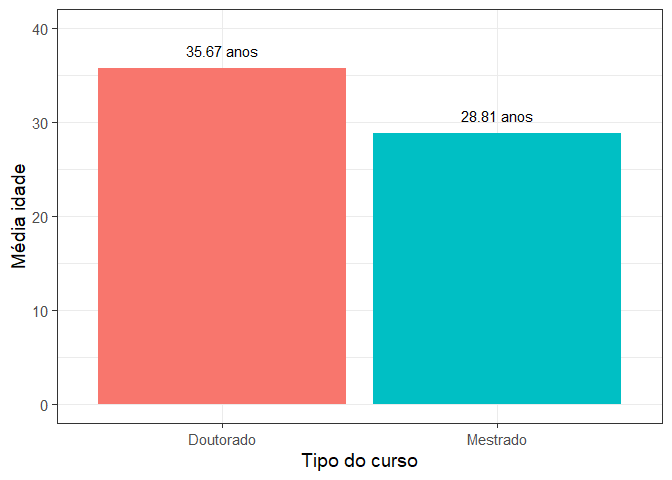
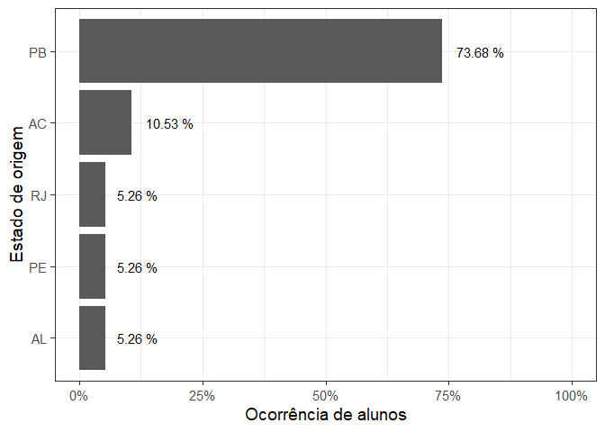
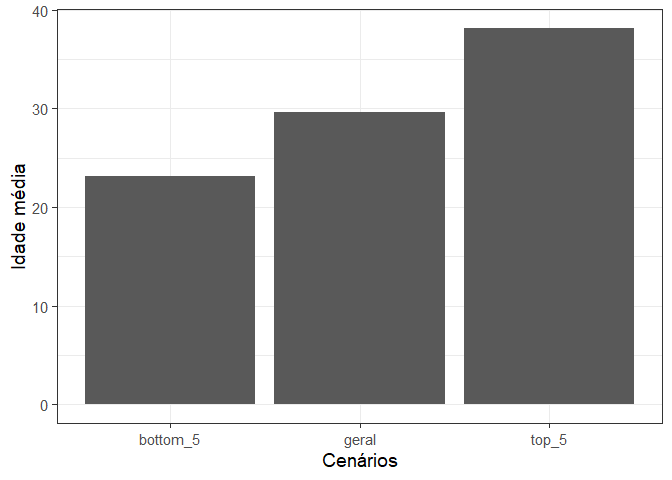

# Importando dados

    ## Rows: 24
    ## Columns: 18
    ## $ `Curso no PPGCC / UFCG`                                                                                                                  <chr> ~
    ## $ `Tipo de matrícula`                                                                                                                      <chr> ~
    ## $ `Quão confiante você se sente com as seguintes tarefas [Descrever uma variável usando conceitos como média, mediana e desvio padrão]`    <chr> ~
    ## $ `Quão confiante você se sente com as seguintes tarefas [Criar visualizações de dados como histogramas e gráficos de dispersão]`          <chr> ~
    ## $ `Quão confiante você se sente com as seguintes tarefas [Ler material técnico em inglês]`                                                 <chr> ~
    ## $ `Quão confiante você se sente com as seguintes tarefas [Programar em R]`                                                                 <chr> ~
    ## $ `Quão confiante você se sente com as seguintes tarefas [Descrever um modelo de regressão linear]`                                        <chr> ~
    ## $ `Quão confiante você se sente com as seguintes tarefas [Descrever um modelo de regressão logística]`                                     <chr> ~
    ## $ `Você tem experiência com: [Pesquisa]`                                                                                                   <chr> ~
    ## $ `Você tem experiência com: [Desenvolvimento de software (fora de disciplinas)]`                                                          <chr> ~
    ## $ `Você tem experiência com: [Administração de sistemas]`                                                                                  <chr> ~
    ## $ `Descreva essas experiências por favor`                                                                                                  <chr> ~
    ## $ `Em que área você entende que será o seu mestrado/doutorado? (Ex: sistemas distribuídos, IA, interface humano-máquina)`                  <chr> ~
    ## $ `Alguma outra informação, experiência, expectativa ou qualquer outra coisa que você queira compartilhar sobre você relacionado a FPCC2?` <chr> ~
    ## $ `Sua idade (pode mentir se preferir)`                                                                                                    <chr> ~
    ## $ `Quantidade de irmãos (pode mentir se preferir)`                                                                                         <chr> ~
    ## $ `A sua altura em cm (pode mentir se preferir)`                                                                                           <chr> ~
    ## $ `O seu estado (UF) de origem (pode mentir se preferir)`                                                                                  <chr> ~

# Q1: Média e desvio padrão da idade e nível de interesse

-   Considerando o nível de interesse como sendo o quão confiante os
    alunos estão para programar em R

``` r
df_q1 <- turma_fpcc2 %>% 
  select(prog_r, idade) %>% 
  mutate(idade_int = as.integer(gsub("[a-z]|\\.", "", idade))) %>% 
  group_by(prog_r) %>% 
  summarise(media = mean(idade_int),
            desvio = sd(idade_int))
      
df_q1   
```

    ## # A tibble: 4 x 3
    ##   prog_r             media desvio
    ##   <chr>              <dbl>  <dbl>
    ## 1 Bastante confiante  30    11.3 
    ## 2 Médio               31.1   5.72
    ## 3 Nenhuma confiança   28.1   5.70
    ## 4 Um pouco            29.4   5.59

-   Apresentando de forma ordenada, da maior idade para a menor

``` r
df_q1 %>% arrange(-media)
```

    ## # A tibble: 4 x 3
    ##   prog_r             media desvio
    ##   <chr>              <dbl>  <dbl>
    ## 1 Médio               31.1   5.72
    ## 2 Bastante confiante  30    11.3 
    ## 3 Um pouco            29.4   5.59
    ## 4 Nenhuma confiança   28.1   5.70

-   Salvando resultados em um csv

``` r
write_csv(df_q1, file = "../data/q1_data.csv")
```

-   **Observação:** Como discutido em aula, uma interpretação possível
    seria converter os valores categóricos do interesse para valores
    ordinais, que permitem ranking, mas não seria possível calcular
    médias desses valores. Todavia, essas opções não serão penalizadas
    na correção.

# Q2: Curso com maior valor médio de idade

-   É preciso manipular novamente as idades se isso não foi realizado e
    salvo anteriormente

``` r
df_q2 <- turma_fpcc2 %>% 
  select(tipo_curso, idade) %>% 
  mutate(idade_int = as.integer(gsub("[a-z]|\\.", "", idade))) %>% 
  group_by(tipo_curso) %>% 
  summarise(media = mean(idade_int))
      
curso_q2 <- df_q2 %>% filter(media == max(media)) %>% pull(tipo_curso)
```

O curso com maior média de idade é Doutorado.

# Q3: Gráfico que mostra a idade média para cada curso

-   Usando o datframe usado para a questão 2

``` r
p_q3 <- ggplot(df_q2, aes(tipo_curso, media, fill = tipo_curso)) + 
  geom_bar(stat = "identity") + 
  geom_text(aes(label = paste(round(media, digits = 2), "anos"), vjust = -1)) + 
  labs(x = "Tipo do curso", y= "Média idade") + 
  theme_bw(base_size = 14) + 
  theme(legend.position = "None") + 
  scale_y_continuous(limits = c(0, 40))

p_q3
```


\* Salvando o plot anterior em um arquivo

``` r
ggsave("../data/plot_q3.png", width = 5, height = 5)
```

# Q4: Percentual de alunos para cada estado de origem

-   Manipulação semelhante a mostrada em sala

``` r
df_q4 <- turma_fpcc2 %>% select(uf) %>% 
  mutate(uf = ifelse(uf == "Opção 1", NA, uf)) %>% 
  mutate(uf = case_when(
    uf == "Paraiba" ~ "PB", 
    uf == "Paraíba" ~ "PB",
    uf == "PB (Campina Grande)" ~ "PB",
    uf == "Acre" ~ "AC",
    uf == "Alagoas" ~ "AL",
    uf == "Pernambuco, mas moro em Campina Grande há mais de 20 anos" ~ "PE",
    TRUE ~ uf
  )) %>% 
  filter(!is.na(uf)) %>%
  count(uf) %>% 
  arrange(-n, uf) %>%
  mutate(percentual = n / sum(n)) %>%
  select(-n) %>% 
  arrange(percentual) %>% 
  mutate(uf=factor(uf, levels=uf))


ggplot(df_q4, aes(uf, percentual)) +  
  geom_bar(stat = "identity") + 
  geom_text(aes(label = paste(round(percentual*100, digits = 2), "%"), hjust = -0.3)) + 
  labs(x = "Estado de origem", y= "Ocorrência de alunos") + 
  theme_bw(base_size = 14) + 
  scale_y_continuous(limits = c(0, 1), labels = percent) + 
  coord_flip()
```



-   Salvando o plot anterior em um arquivo

``` r
ggsave("../data/plot_q4.png", width = 5, height = 4)
```

# Q5: Média de idade geral comparada com a média de idade dos top-5 e dos bottom-5

-   Gerando dataframe base com os valores para comparação

``` r
df_q5 <- turma_fpcc2 %>% 
  select(tipo_curso, idade) %>% 
  mutate(idade_int = as.integer(gsub("[a-z]|\\.", "", idade))) %>% 
  select(idade = idade_int) %>%
  arrange(-idade) %>% 
  summarise(geral = mean(idade),
            top_5 = mean(head(idade, 5)),
            bottom_5 = mean(tail(idade, 5)))

df_q5  
```

    ## # A tibble: 1 x 3
    ##   geral top_5 bottom_5
    ##   <dbl> <dbl>    <dbl>
    ## 1  29.7  38.2     23.2

-   Manipulando dataframe para facilitar comparação e visualização

``` r
library(tidyr)
df_q5b <- df_q5 %>% gather("metric", "value", 1:3) 
df_q5b
```

    ## # A tibble: 3 x 2
    ##   metric   value
    ##   <chr>    <dbl>
    ## 1 geral     29.7
    ## 2 top_5     38.2
    ## 3 bottom_5  23.2

``` r
ggplot(df_q5b, aes(metric, value)) + 
  geom_bar(stat = "identity") + 
  labs(x = "Cenários", y= "Idade média") + 
  theme_bw(base_size = 14)
```


