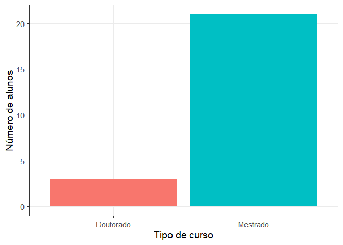
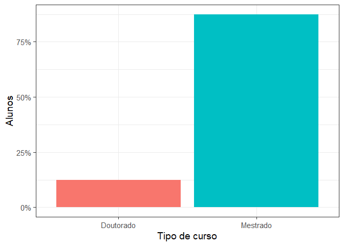
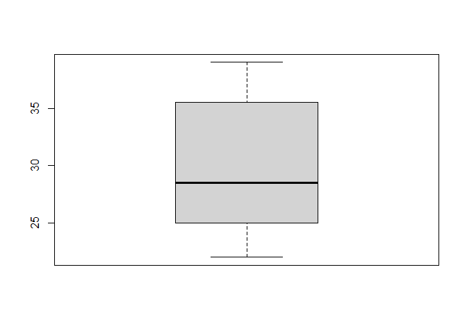

# Importando dados

    ## 
    ## Attaching package: 'dplyr'

    ## The following objects are masked from 'package:stats':
    ## 
    ##     filter, lag

    ## The following objects are masked from 'package:base':
    ## 
    ##     intersect, setdiff, setequal, union

    ## 
    ## Attaching package: 'readr'

    ## The following object is masked from 'package:scales':
    ## 
    ##     col_factor

    ## here() starts at C:/Users/Fabio/workspace/fpcc2-lab1

    ## 
    ## -- Column specification --------------------------------------------------------
    ## cols(
    ##   `Curso no PPGCC / UFCG` = col_character(),
    ##   `Tipo de matrícula` = col_character(),
    ##   `Quão confiante você se sente com as seguintes tarefas [Descrever uma variável usando conceitos como média, mediana e desvio padrão]` = col_character(),
    ##   `Quão confiante você se sente com as seguintes tarefas [Criar visualizações de dados como histogramas e gráficos de dispersão]` = col_character(),
    ##   `Quão confiante você se sente com as seguintes tarefas [Ler material técnico em inglês]` = col_character(),
    ##   `Quão confiante você se sente com as seguintes tarefas [Programar em R]` = col_character(),
    ##   `Quão confiante você se sente com as seguintes tarefas [Descrever um modelo de regressão linear]` = col_character(),
    ##   `Quão confiante você se sente com as seguintes tarefas [Descrever um modelo de regressão logística]` = col_character(),
    ##   `Você tem experiência com: [Pesquisa]` = col_character(),
    ##   `Você tem experiência com: [Desenvolvimento de software (fora de disciplinas)]` = col_character(),
    ##   `Você tem experiência com: [Administração de sistemas]` = col_character(),
    ##   `Descreva essas experiências por favor` = col_character(),
    ##   `Em que área você entende que será o seu mestrado/doutorado? (Ex: sistemas distribuídos, IA, interface humano-máquina)` = col_character(),
    ##   `Alguma outra informação, experiência, expectativa ou qualquer outra coisa que você queira compartilhar sobre você relacionado a FPCC2?` = col_character(),
    ##   `Sua idade (pode mentir se preferir)` = col_character(),
    ##   `Quantidade de irmãos (pode mentir se preferir)` = col_character(),
    ##   `A sua altura em cm (pode mentir se preferir)` = col_character(),
    ##   `O seu estado (UF) de origem (pode mentir se preferir)` = col_character()
    ## )

    ## Rows: 24
    ## Columns: 18
    ## $ `Curso no PPGCC / UFCG`                                                                                                                  <chr> ~
    ## $ `Tipo de matrícula`                                                                                                                      <chr> ~
    ## $ `Quão confiante você se sente com as seguintes tarefas [Descrever uma variável usando conceitos como média, mediana e desvio padrão]`    <chr> ~
    ## $ `Quão confiante você se sente com as seguintes tarefas [Criar visualizações de dados como histogramas e gráficos de dispersão]`          <chr> ~
    ## $ `Quão confiante você se sente com as seguintes tarefas [Ler material técnico em inglês]`                                                 <chr> ~
    ## $ `Quão confiante você se sente com as seguintes tarefas [Programar em R]`                                                                 <chr> ~
    ## $ `Quão confiante você se sente com as seguintes tarefas [Descrever um modelo de regressão linear]`                                        <chr> ~
    ## $ `Quão confiante você se sente com as seguintes tarefas [Descrever um modelo de regressão logística]`                                     <chr> ~
    ## $ `Você tem experiência com: [Pesquisa]`                                                                                                   <chr> ~
    ## $ `Você tem experiência com: [Desenvolvimento de software (fora de disciplinas)]`                                                          <chr> ~
    ## $ `Você tem experiência com: [Administração de sistemas]`                                                                                  <chr> ~
    ## $ `Descreva essas experiências por favor`                                                                                                  <chr> ~
    ## $ `Em que área você entende que será o seu mestrado/doutorado? (Ex: sistemas distribuídos, IA, interface humano-máquina)`                  <chr> ~
    ## $ `Alguma outra informação, experiência, expectativa ou qualquer outra coisa que você queira compartilhar sobre você relacionado a FPCC2?` <chr> ~
    ## $ `Sua idade (pode mentir se preferir)`                                                                                                    <chr> ~
    ## $ `Quantidade de irmãos (pode mentir se preferir)`                                                                                         <chr> ~
    ## $ `A sua altura em cm (pode mentir se preferir)`                                                                                           <chr> ~
    ## $ `O seu estado (UF) de origem (pode mentir se preferir)`                                                                                  <chr> ~
    ## Rows: 24
    ## Columns: 18
    ## $ tipo_curso    <chr> "Mestrado", "Doutorado", "Mestrado", "Mestrado", "Mestra~
    ## $ matricula     <chr> "Regular", "Regular", "Regular", "Regular", "Regular", "~
    ## $ conf_sumarios <chr> "Bastante confiante", "Bastante confiante", "Um pouco", ~
    ## $ conf_histo    <chr> "Bastante confiante", "Bastante confiante", "Um pouco", ~
    ## $ ler_ingles    <chr> "Bastante confiante", "Médio", "Um pouco", "Totalmente c~
    ## $ prog_r        <chr> "Médio", "Médio", "Nenhuma confiança", "Médio", "Nenhuma~
    ## $ linear        <chr> "Um pouco", "Médio", "Um pouco", "Médio", "Médio", "Bast~
    ## $ logistica     <chr> "Um pouco", "Um pouco", "Um pouco", "Médio", "Nenhuma co~
    ## $ exp_pesq      <chr> "1 ano", "3 anos", "0 anos", "3 anos", "0 anos", "2 anos~
    ## $ exp_dev       <chr> "3 anos", "1 ano", "0 anos", "1 ano", "4+ anos", "1 ano"~
    ## $ exp_admin     <chr> "0 anos", "1 ano", "0 anos", "2 anos", "0 anos", "0 anos~
    ## $ exp_desc      <chr> NA, "Pesquisa: Mestrado e Projetos PIBIC e PIBITI. Desen~
    ## $ area          <chr> "IA, NLP", "Inteligência Artificial na Educação", "Siste~
    ## $ outra         <chr> NA, NA, NA, "Tenho bastante interesse nas áreas de lingu~
    ## $ idade         <chr> "29", "36", "26", "29", "25", "22", "24", "28", "27", "3~
    ## $ irmaos        <chr> "3", "1", "2", "2", "1", "1", "0", "1", "2", "1", "4", "~
    ## $ altura        <chr> "178", "152", "1,65", "170,5", "174", "167", "180", "176~
    ## $ uf            <chr> "PB", "Alagoas", "Opção 1", "PB", "PB", "PB", "Opção 1",~

# Qual a quantidade e percentual de alunos em cada tipo de curso (mestrado ou doutorado)?

``` r
q1 <- turma_fpcc2 %>% select(tipo_curso, matricula) %>% 
  group_by(tipo_curso) %>% 
  summarise(num = n()) %>% 
  mutate(perc = paste(num / nrow(turma_fpcc2) * 100, "%", sep = ""),
         perc2 = num / nrow(turma_fpcc2))

ggplot(q1, aes(tipo_curso, num, fill = tipo_curso)) + 
  geom_bar(stat = "identity") + 
  xlab("Tipo de curso") +
  ylab("Número de alunos") + 
  theme_bw(base_size = 14) + 
  theme(legend.position = "None")
```



``` r
ggplot(q1, aes(tipo_curso, perc2, fill = tipo_curso)) + 
  geom_bar(stat = "identity") + 
  xlab("Tipo de curso") +
  ylab("Alunos") + 
  theme_bw(base_size = 14) + 
  scale_y_continuous(labels = percent) + 
  theme(legend.position = "None")
```



# Qual a faixa etária (média, desvio padrão, mínimo, máximo)? Boxplot dos dados da idade (mediana)

``` r
df_idade <- turma_fpcc2 %>% select(idade) %>% 
  mutate(idade_int = as.integer(gsub("[a-z]|\\.", "", idade)))

mean(df_idade$idade_int)
```

    ## [1] 29.66667

``` r
min(df_idade$idade_int)
```

    ## [1] 22

``` r
max(df_idade$idade_int)
```

    ## [1] 39

``` r
median(df_idade$idade_int)
```

    ## [1] 28.5

``` r
sd(df_idade$idade_int)
```

    ## [1] 5.798551

``` r
summary(df_idade$idade_int)
```

    ##    Min. 1st Qu.  Median    Mean 3rd Qu.    Max. 
    ##   22.00   25.00   28.50   29.67   35.25   39.00

``` r
boxplot(df_idade$idade_int)
```



# Qual a quantidade de alunos por estado?

``` r
turma_fpcc2 %>% select(uf) %>% 
  filter(uf != "Opção 1")
```

    ## # A tibble: 19 x 1
    ##    uf                                                       
    ##    <chr>                                                    
    ##  1 PB                                                       
    ##  2 Alagoas                                                  
    ##  3 PB                                                       
    ##  4 PB                                                       
    ##  5 PB                                                       
    ##  6 PB                                                       
    ##  7 Paraíba                                                  
    ##  8 Acre                                                     
    ##  9 PB                                                       
    ## 10 Paraiba                                                  
    ## 11 PB                                                       
    ## 12 PB                                                       
    ## 13 Paraíba                                                  
    ## 14 PB (Campina Grande)                                      
    ## 15 Pernambuco, mas moro em Campina Grande há mais de 20 anos
    ## 16 PB                                                       
    ## 17 Acre                                                     
    ## 18 PB                                                       
    ## 19 RJ

``` r
turma_fpcc2 %>% select(uf) %>% 
  mutate(uf = ifelse(uf == "Opção 1", NA, uf)) %>% 
  mutate(uf = case_when(
    uf == "Paraiba" ~ "PB", 
    uf == "Paraíba" ~ "PB",
    uf == "PB (Campina Grande)" ~ "PB",
    uf == "Acre" ~ "AC",
    uf == "Alagoas" ~ "AL",
    uf == "Pernambuco, mas moro em Campina Grande há mais de 20 anos" ~ "PE",
    TRUE ~ uf
  )) %>% 
  filter(!is.na(uf)) %>%
  count(uf) %>% 
  arrange(-n, uf)
```

    ## # A tibble: 5 x 2
    ##   uf        n
    ##   <chr> <int>
    ## 1 PB       14
    ## 2 AC        2
    ## 3 AL        1
    ## 4 PE        1
    ## 5 RJ        1

``` r
ufs <- c("PB", "PB", "PB", "PB", "AC", "AL", "PE")
names <- c("PB", "Paraiba", "Paraíba", "PB (Campina Grande)", "Acre", "Alagoas", 
           "Pernambuco, mas moro em Campina Grande há mais de 20 anos")

df_uf <- data.frame(uf = names, ufs)
turma_fpcc2 %>% select(uf) %>% 
  full_join(df_uf)
```

    ## Joining, by = "uf"

    ## # A tibble: 24 x 2
    ##    uf      ufs  
    ##    <chr>   <chr>
    ##  1 PB      PB   
    ##  2 Alagoas AL   
    ##  3 Opção 1 <NA> 
    ##  4 PB      PB   
    ##  5 PB      PB   
    ##  6 PB      PB   
    ##  7 Opção 1 <NA> 
    ##  8 PB      PB   
    ##  9 Paraíba PB   
    ## 10 Opção 1 <NA> 
    ## # ... with 14 more rows
